Visualization
================
Christina Chen
2026-10-01

``` r
library(tidyverse)
```

    ## ── Attaching core tidyverse packages ──────────────────────── tidyverse 2.0.0 ──
    ## ✔ dplyr     1.2.1     ✔ readr     2.2.0
    ## ✔ forcats   1.0.1     ✔ stringr   1.6.0
    ## ✔ ggplot2   4.0.3     ✔ tibble    3.3.1
    ## ✔ lubridate 1.9.5     ✔ tidyr     1.3.2
    ## ✔ purrr     1.2.2     
    ## ── Conflicts ────────────────────────────────────────── tidyverse_conflicts() ──
    ## ✖ dplyr::filter() masks stats::filter()
    ## ✖ dplyr::lag()    masks stats::lag()
    ## ℹ Use the conflicted package (<http://conflicted.r-lib.org/>) to force all conflicts to become errors

``` r
library(ggridges)

library(p8105.datasets)
data("weather_df")
```

Now we have everything we need!

``` r
weather_df
```

    ## # A tibble: 2,190 × 6
    ##    name           id          date        prcp  tmax  tmin
    ##    <chr>          <chr>       <date>     <dbl> <dbl> <dbl>
    ##  1 CentralPark_NY USW00094728 2021-01-01   157   4.4   0.6
    ##  2 CentralPark_NY USW00094728 2021-01-02    13  10.6   2.2
    ##  3 CentralPark_NY USW00094728 2021-01-03    56   3.3   1.1
    ##  4 CentralPark_NY USW00094728 2021-01-04     5   6.1   1.7
    ##  5 CentralPark_NY USW00094728 2021-01-05     0   5.6   2.2
    ##  6 CentralPark_NY USW00094728 2021-01-06     0   5     1.1
    ##  7 CentralPark_NY USW00094728 2021-01-07     0   5    -1  
    ##  8 CentralPark_NY USW00094728 2021-01-08     0   2.8  -2.7
    ##  9 CentralPark_NY USW00094728 2021-01-09     0   2.8  -4.3
    ## 10 CentralPark_NY USW00094728 2021-01-10     0   5    -1.6
    ## # ℹ 2,180 more rows

Let’s make a scatterplot!

``` r
ggplot(weather_df, aes(x = tmin, y = tmax))
```

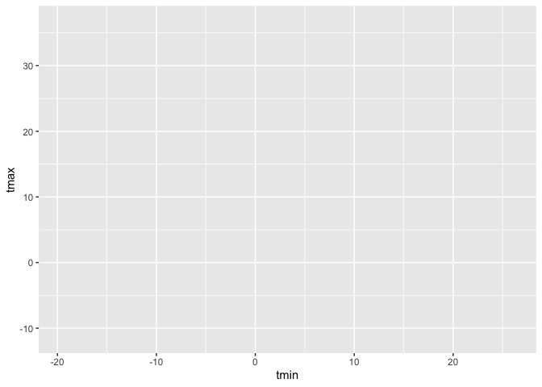<!-- -->

``` r
ggplot(weather_df, aes(x = tmin, y = tmax)) + geom_point()
```

    ## Warning: Removed 17 rows containing missing values or values outside the scale range
    ## (`geom_point()`).

<!-- -->

I always like the dataframe first.

``` r
ggp_temp_scattterplot = 
weather_df |> 
  ggplot(aes(x = tmin, y = tmax)) +
  geom_point()
```

Let’s make this a bit fancier…

``` r
weather_df |> 
  ggplot(aes(x = tmin, y = tmax, color = name)) +
  geom_point(alpha = .25) +
  geom_smooth(se = FALSE)
```

    ## `geom_smooth()` using method = 'loess' and formula = 'y ~ x'

    ## Warning: Removed 17 rows containing non-finite outside the scale range
    ## (`stat_smooth()`).

    ## Warning: Removed 17 rows containing missing values or values outside the scale range
    ## (`geom_point()`).

<!-- -->

``` r
weather_df |> 
  ggplot(aes(x = tmin, y = tmax)) +
  geom_point(aes(color = name),alpha = .25) +
  geom_smooth(se = FALSE)
```

    ## `geom_smooth()` using method = 'gam' and formula = 'y ~ s(x, bs = "cs")'

    ## Warning: Removed 17 rows containing non-finite outside the scale range
    ## (`stat_smooth()`).
    ## Removed 17 rows containing missing values or values outside the scale range
    ## (`geom_point()`).

<!-- -->

Show faceting

``` r
weather_df |> 
  ggplot(aes(x = tmin, y = tmax, color = name)) +
  geom_point(alpha = .25) +
  facet_grid(. ~ name)
```

    ## Warning: Removed 17 rows containing missing values or values outside the scale range
    ## (`geom_point()`).

<!-- -->

``` r
weather_df |> 
  ggplot(aes(x = tmin, y = tmax, color = name)) +
  geom_point(alpha = .25) +
  facet_grid(cols = vars(name))
```

    ## Warning: Removed 17 rows containing missing values or values outside the scale range
    ## (`geom_point()`).

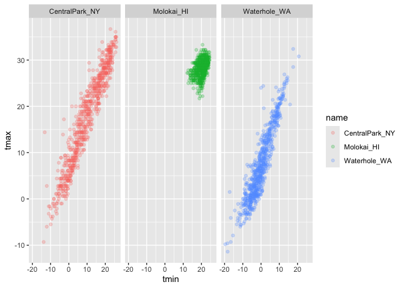<!-- -->

Let’s look at something else.

``` r
weather_df |> 
  ggplot(aes(x = date, y = tmax, color = name)) +
  geom_point(aes(size = prcp), alpha = .5) +
  geom_smooth(se = FALSE) +
  facet_grid(. ~ name)
```

    ## `geom_smooth()` using method = 'loess' and formula = 'y ~ x'

    ## Warning: Removed 17 rows containing non-finite outside the scale range
    ## (`stat_smooth()`).

    ## Warning: Removed 19 rows containing missing values or values outside the scale range
    ## (`geom_point()`).

<!-- -->

make a plot of central park tmax v tmin only, and convert temperatures
to fahrenheit.

``` r
weather_df |> 
  filter(name == "CentralPark_NY") |> 
  mutate(
    tmax = tmax * (9 / 5) + 32,
    tmin = tmin * (9 / 5) + 32
  ) |> 
  ggplot(aes(x = tmin, y = tmax)) + 
  geom_point()
```

<!-- -->

what’s a hex plot

``` r
weather_df |> 
  ggplot(aes(x = tmin, y = tmax)) +
  geom_hex()
```

    ## Warning: Removed 17 rows containing non-finite outside the scale range
    ## (`stat_binhex()`).

<!-- -->

## Univariate plots

``` r
weather_df |> 
  ggplot(aes(x = tmax, fill = name)) +
  geom_histogram(position = "dodge")
```

    ## `stat_bin()` using `bins = 30`. Pick better value `binwidth`.

    ## Warning: Removed 17 rows containing non-finite outside the scale range
    ## (`stat_bin()`).

<!-- -->

``` r
weather_df |> 
  ggplot(aes(x = tmax, fill = name)) +
  geom_histogram() +
  facet_grid(. ~ name)
```

    ## `stat_bin()` using `bins = 30`. Pick better value `binwidth`.

    ## Warning: Removed 17 rows containing non-finite outside the scale range
    ## (`stat_bin()`).

<!-- -->

Density plots are great!!

``` r
weather_df |> 
  ggplot(aes(x = tmax, fill = name)) +
  geom_density(alpha = .3)
```

    ## Warning: Removed 17 rows containing non-finite outside the scale range
    ## (`stat_density()`).

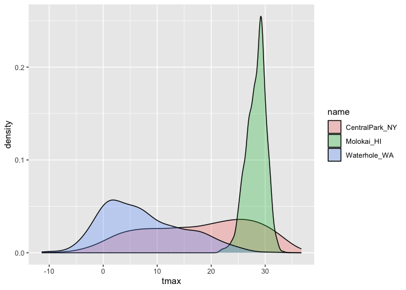<!-- -->

Boxplots

``` r
weather_df |> 
  ggplot(aes(x = name, y = tmax)) +
  geom_boxplot()
```

    ## Warning: Removed 17 rows containing non-finite outside the scale range
    ## (`stat_boxplot()`).

<!-- -->

Violin plots (looks a bit like combined boxplot and density plot)

``` r
weather_df |> 
  ggplot(aes(x = name, y = tmax, fill = name)) +
  geom_violin()
```

    ## Warning: Removed 17 rows containing non-finite outside the scale range
    ## (`stat_ydensity()`).

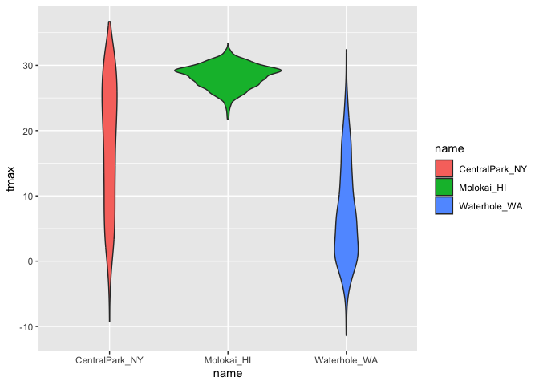<!-- -->

Ridge plots …

``` r
weather_df |> 
  ggplot(aes(x = tmax, fill = name)) +
  geom_density()
```

    ## Warning: Removed 17 rows containing non-finite outside the scale range
    ## (`stat_density()`).

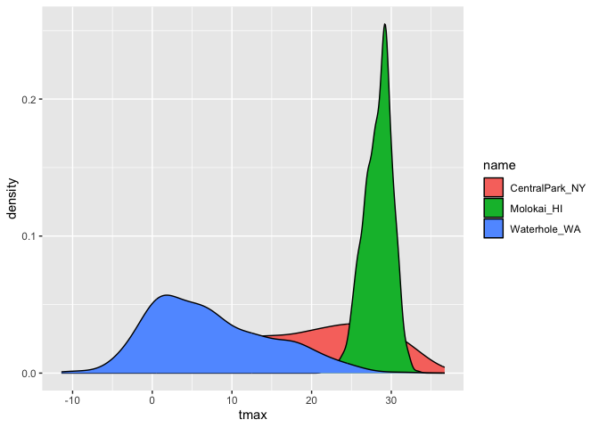<!-- -->

``` r
weather_df |> 
  ggplot(aes(x = tmax, y = name)) +
  geom_density_ridges()
```

    ## Picking joint bandwidth of 1.54

    ## Warning: Removed 17 rows containing non-finite outside the scale range
    ## (`stat_density_ridges()`).

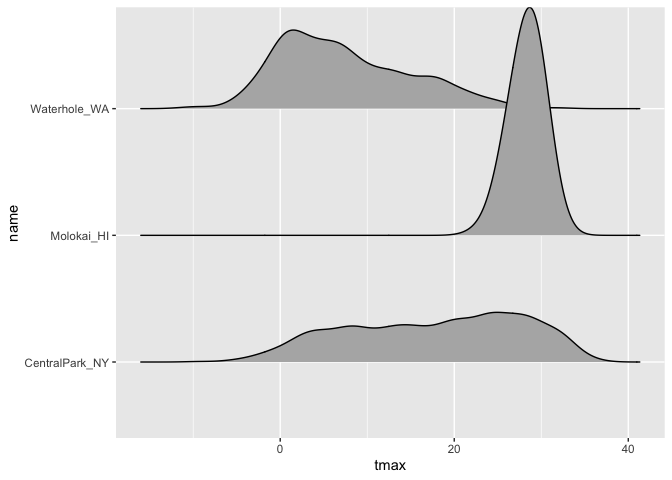<!-- -->

## Save some of my plots

``` r
ggp_weather =
  weather_df |> 
  ggplot(aes(x = date, y = tmax, color = name)) +
  geom_point(aes(size = prcp), alpha = .5) + 
  facet_grid(. ~ name)

ggp_weather
```

    ## Warning: Removed 19 rows containing missing values or values outside the scale range
    ## (`geom_point()`).

<!-- -->

``` r
ggsave("images/ggp_weather.pdf", ggp_weather)
```

    ## Saving 7 x 5 in image

    ## Warning: Removed 19 rows containing missing values or values outside the scale range
    ## (`geom_point()`).

``` r
weather_df |> 
  ggplot(aes(x = tmin, y = tmax)) +
  geom_point()
```

    ## Warning: Removed 17 rows containing missing values or values outside the scale range
    ## (`geom_point()`).

<!-- -->

## Remember this plot ..?

``` r
weather_df |> 
  ggplot(aes(x = tmin, y = tmax, color = name)) +
  geom_point(alpha = .5)
```

    ## Warning: Removed 17 rows containing missing values or values outside the scale range
    ## (`geom_point()`).

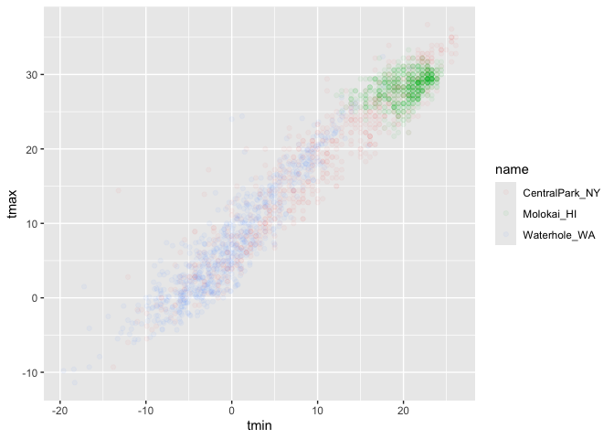<!-- -->

## Labels

``` r
weather_df |> 
  ggplot(aes(x = tmin, y = tmax, color = name)) +
  geom_point(alpha = .5) +
  labs(
    title = "Temperature plot",
    x = "Minimum daily temperature (C)",
    y = "Maximum daily temperature (C)",
    caption = "Data from rnoaa package; temperatures in 2017."
  )
```

    ## Warning: Removed 17 rows containing missing values or values outside the scale range
    ## (`geom_point()`).

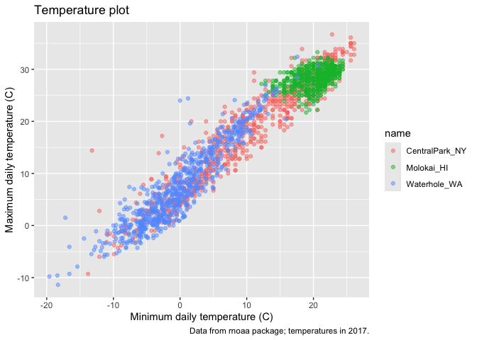<!-- -->

## Scales

Start with the same plot

``` r
weather_df |> 
  ggplot(aes(x = tmin, y = tmax, color = name)) +
  geom_point(alpha = .5) +
  labs(
    title = "Temperature plot",
    x = "Minimum daily temperature (C)",
    y = "Maximum daily temperature (C)",
    caption = "Data from rnoaa package; temperatures in 2017."
  ) +
  scale_x_continuous(
    breaks = c(-15, 0, 15),
    labels = c("-15 C", "0", "15")
  ) +
  scale_y_continuous(
    trans = "sqrt",
    position = "right"
  )
```

    ## Warning in transformation$transform(x): NaNs produced

    ## Warning in scale_y_continuous(trans = "sqrt", position = "right"): sqrt
    ## transformation introduced infinite values.

    ## Warning: Removed 142 rows containing missing values or values outside the scale range
    ## (`geom_point()`).

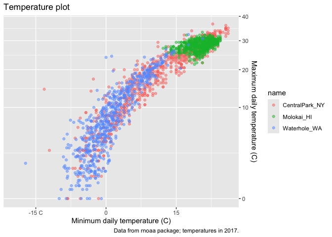<!-- -->

Look at color scales

``` r
weather_df |> 
  ggplot(aes(x = tmin, y = tmax, color = name)) +
  geom_point(alpha = .5) +
  labs(
    title = "Temperature plot",
    x = "Minimum daily temperature (C)",
    y = "Maximum daily temperature (C)",
    caption = "Data from rnoaa package; temperatures in 2017."
  ) +
  scale_color_hue(
    name = "Location",
    h = c(100, 300))
```

    ## Warning: Removed 17 rows containing missing values or values outside the scale range
    ## (`geom_point()`).

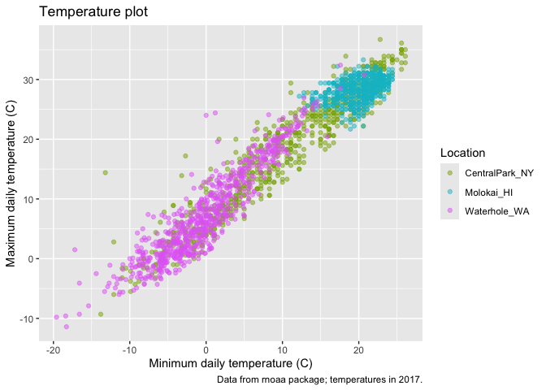<!-- -->

``` r
weather_df |> 
  ggplot(aes(x = tmin, y = tmax, color = name)) +
  geom_point(alpha = .5) +
  labs(
    title = "Temperature plot",
    x = "Minimum daily temperature (C)",
    y = "Maximum daily temperature (C)",
    caption = "Data from rnoaa package; temperatures in 2017."
  ) +
  viridis::scale_color_viridis(
    name = "Location",
    discrete = TRUE)
```

    ## Warning: Removed 17 rows containing missing values or values outside the scale range
    ## (`geom_point()`).

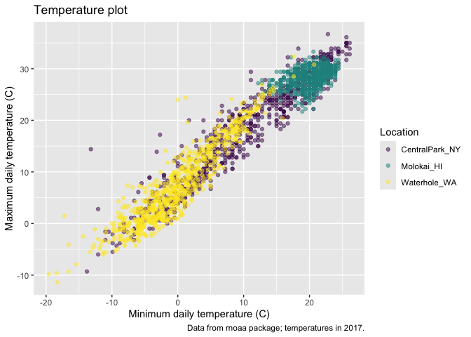<!-- -->

## Themes

Shift the legend.

``` r
weather_df |> 
  ggplot(aes(x = tmin, y = tmax, color = name)) +
  geom_point(alpha = .5) +
  labs(
    title = "Temperature plot",
    x = "Minimum daily temperature (C)",
    y = "Maximum daily temperature (C)",
    caption = "Data from rnoaa package; temperatures in 2017."
  ) +
  viridis::scale_color_viridis(
    name = "Location",
    discrete = TRUE) +
  theme(legend.position = "bottom")
```

    ## Warning: Removed 17 rows containing missing values or values outside the scale range
    ## (`geom_point()`).

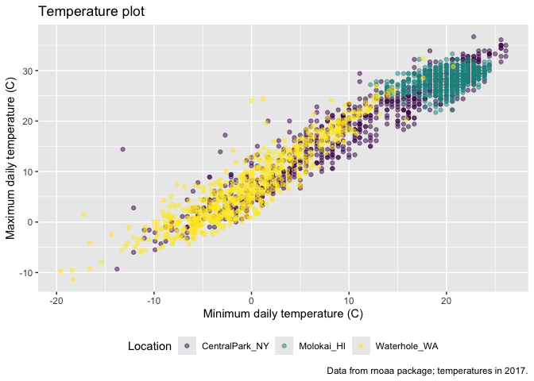<!-- -->

Change the overall theme.

``` r
weather_df |> 
  ggplot(aes(x = tmin, y = tmax, color = name)) +
  geom_point(alpha = .5) +
  labs(
    title = "Temperature plot",
    x = "Minimum daily temperature (C)",
    y = "Maximum daily temperature (C)",
    caption = "Data from rnoaa package; temperatures in 2017."
  ) +
  viridis::scale_color_viridis(
    name = "Location",
    discrete = TRUE) +
  theme_minimal() +
  theme(legend.position = "bottom")
```

    ## Warning: Removed 17 rows containing missing values or values outside the scale range
    ## (`geom_point()`).

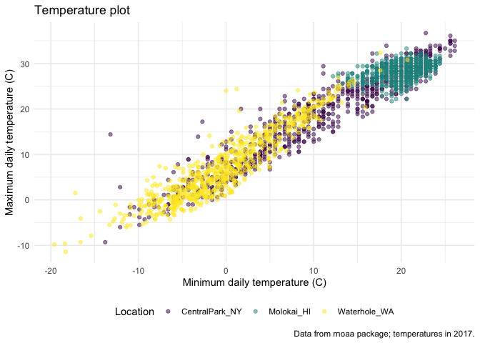<!-- -->

## Setting options

``` r
library(tidyverse)

knitr::opts_chunk$set(
  fig.width = 6,
  fig.esp = .6,
  out.width = "90%"
)
theme_set(theme_minimal() + theme(legend.position = "bottom"))

options(
  ggplot2.continuous.colour = "viridis",
  ggplot2.continuous.fill = "viridis"
)

scale_colour_discrete = scale_color_viridis_d
scale_fill_discrete = scale_fill_viridis_d
```
